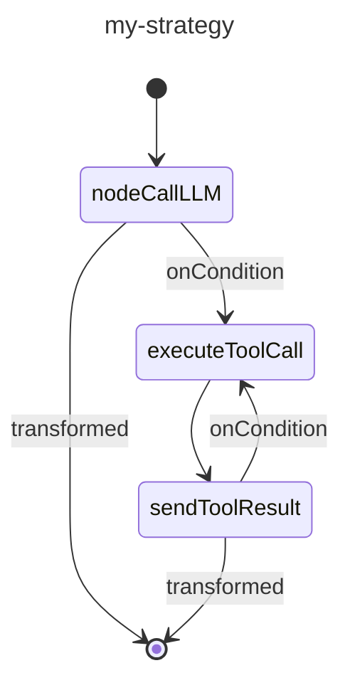

# Custom strategy graphs

Strategy graphs are the backbone of agent workflows in the Koog framework. They define how the agent processes input,
interacts with tools, and generates output. A strategy graph consists of nodes connected by edges, with conditions
determining the flow of execution.

Creating a strategy graph lets you tailor the behavior of an agent to your specific needs, whether you are
building a simple chatbot, a complex data processing pipeline, or anything in between.

## Strategy graph architecture

At a high level, a strategy graph consists of the following components:

- **Strategy**: the top-level container for the graph, created using the `strategy` function with the specified input 
  and output types using generic parameters.
- **Subgraphs**: sections of the graph that can have their own set of tools and context.
- **Nodes**: individual operations or transformations in the workflow.
- **Edges**: connections between nodes that define transition conditions and transformations.

The strategy graph begins at a special node called `nodeStart` and ends at `nodeFinish`.
The path between these nodes is determined by the edges and conditions specified in the graph.

## Strategy graph components

### Nodes

Nodes are building blocks of a strategy graph. Each node represents a specific operation.

The Koog framework provides predefined nodes and also lets you create custom nodes by using the `node` function.

For details, see [Predefined nodes and components](nodes-and-components.md) and [Custom nodes](custom-nodes.md).

### Edges

Edges connect nodes and define the flow of operation in the strategy graph.
An edge is created using the `edge` function and the `forwardTo` infix function:

<!--- INCLUDE
import ai.koog.agents.core.dsl.builder.forwardTo
import ai.koog.agents.core.dsl.builder.strategy

val strategy = strategy<String, String>("strategy_name") {
        val sourceNode by node<String, String> { input -> input }
        val targetNode by node<String, String> { input -> input }
-->
<!--- SUFFIX
}
-->
```kotlin
edge(sourceNode forwardTo targetNode)
```
<!--- KNIT example-custom-strategy-graphs-01.kt -->

#### Conditions

Conditions determine when to follow a particular edge in the strategy graph. There are several types of conditions, here are some common ones:

| Condition type      | Description                                                                              |
|---------------------|------------------------------------------------------------------------------------------|
| onCondition         | A general-purpose condition that takes a lambda expression that returns a boolean value. |
| onToolCall          | A condition that matches when the LLM calls a tool.                                      |
| onAssistantMessage  | A condition that matches when the LLM responds with a message.                           |
| onMultipleToolCalls | A condition that matches when the LLM calls multiple tools.                              |
| onToolNotCalled     | A condition that matches when the LLM does not call a tool.                              |

You can transform the output before passing it to the target node by using the `transformed` function:

<!--- INCLUDE
import ai.koog.agents.core.dsl.builder.forwardTo
import ai.koog.agents.core.dsl.builder.strategy

val strategy = strategy<String, String>("strategy_name") {
        val sourceNode by node<String, String> { input -> input }
        val targetNode by node<String, String> { input -> input }
-->
<!--- SUFFIX
}
-->
```kotlin
edge(sourceNode forwardTo targetNode 
        onCondition { input -> input.length > 10 }
        transformed { input -> input.uppercase() }
)
```
<!--- KNIT example-custom-strategy-graphs-02.kt -->


### Subgraphs

Subgraphs are sections of the strategy graph that operate with their own set of tools and context.
The strategy graph can contain multiple subgraphs. Each subgraph is defined by using the `subgraph` function:

<!--- INCLUDE
import ai.koog.agents.core.dsl.builder.strategy

typealias Input = String
typealias Output = Int

typealias FirstInput = String
typealias FirstOutput = Int

typealias SecondInput = String
typealias SecondOutput = Int
-->
```kotlin
val strategy = strategy<Input, Output>("strategy-name") {
    val firstSubgraph by subgraph<FirstInput, FirstOutput>("first") {
        // Define nodes and edges for this subgraph
    }
    val secondSubgraph by subgraph<SecondInput, SecondOutput>("second") {
        // Define nodes and edges for this subgraph
    }
}
```
<!--- KNIT example-custom-strategy-graphs-03.kt -->

A subgraph can use any tool from a tool registry. 
However, you can specify a subset of tools from this registry that can be used in the subgraph and pass it as an argument to the `subgraph` function:

<!--- INCLUDE
import ai.koog.agents.core.dsl.builder.strategy
import ai.koog.agents.ext.tool.SayToUser

typealias Input = String
typealias Output = Int

typealias FirstInput = String
typealias FirstOutput = Int

val someTool = SayToUser

-->
```kotlin
val strategy = strategy<Input, Output>("strategy-name") {
    val firstSubgraph by subgraph<FirstInput, FirstOutput>(
        name = "first",
        tools = listOf(someTool)
    ) {
        // Define nodes and edges for this subgraph
    }
   // Define other subgraphs
}
```
<!--- KNIT example-custom-strategy-graphs-04.kt -->

## Basic strategy graph creation

The basic strategy graph operates as follows: 

1. Sends the input to the LLM.
2. If the LLM responds with a message, finishes the process.
3. If the LLM calls a tool, runs the tool.
4. Sends the tool result back to the LLM.
5. If the LLM responds with a message, finishes the process.
6. If the LLM calls another tool, runs the tool, and the process repeats from step 4.


Here is an example of a basic strategy graph:

<!--- INCLUDE
import ai.koog.agents.core.dsl.builder.forwardTo
import ai.koog.agents.core.dsl.builder.strategy
import ai.koog.agents.core.dsl.extension.nodeExecuteTool
import ai.koog.agents.core.dsl.extension.nodeLLMRequest
import ai.koog.agents.core.dsl.extension.nodeLLMSendToolResult
import ai.koog.agents.core.dsl.extension.onAssistantMessage
import ai.koog.agents.core.dsl.extension.onToolCall

-->
```kotlin
val myStrategy = strategy<String, String>("my-strategy") {
    val nodeCallLLM by nodeLLMRequest()
    val executeToolCall by nodeExecuteTool()
    val sendToolResult by nodeLLMSendToolResult()

    edge(nodeStart forwardTo nodeCallLLM)
    edge(nodeCallLLM forwardTo nodeFinish onAssistantMessage { true })
    edge(nodeCallLLM forwardTo executeToolCall onToolCall { true })
    edge(executeToolCall forwardTo sendToolResult)
    edge(sendToolResult forwardTo nodeFinish onAssistantMessage { true })
    edge(sendToolResult forwardTo executeToolCall onToolCall { true })
}
```
<!--- KNIT example-custom-strategy-graphs-05.kt -->

## Visualizing strategy graph 

On JVM you may generate a [Mermaid state diagram](https://mermaid.js.org/syntax/stateDiagram.html) for the strategy graph.

For the graph created in the previous example, you can run:

<!--- INCLUDE
import ai.koog.agents.core.agent.asMermaidDiagram
import ai.koog.agents.core.dsl.builder.forwardTo
import ai.koog.agents.core.dsl.builder.strategy
import ai.koog.agents.core.dsl.extension.nodeExecuteTool
import ai.koog.agents.core.dsl.extension.nodeLLMRequest
import ai.koog.agents.core.dsl.extension.nodeLLMSendToolResult
import ai.koog.agents.core.dsl.extension.onAssistantMessage
import ai.koog.agents.core.dsl.extension.onToolCall

fun main() {
    val myStrategy = strategy("my-strategy") {
        val nodeCallLLM by nodeLLMRequest()
        val executeToolCall by nodeExecuteTool()
        val sendToolResult by nodeLLMSendToolResult()
    
        edge(nodeStart forwardTo nodeCallLLM)
        edge(nodeCallLLM forwardTo nodeFinish onAssistantMessage { true })
        edge(nodeCallLLM forwardTo executeToolCall onToolCall { true })
        edge(executeToolCall forwardTo sendToolResult)
        edge(sendToolResult forwardTo nodeFinish onAssistantMessage { true })
        edge(sendToolResult forwardTo executeToolCall onToolCall { true })
    }
-->
<!--- SUFFIX
}
-->

```kotlin
val mermaidDiagram: String = myStrategy.asMermaidDiagram()

println(mermaidDiagram)
```

and the output will be:


<!--- KNIT example-custom-strategy-graphs-06.kt -->

## Advanced strategy techniques

### History compression

For long-running conversations, the history can grow large and consume a lot of tokens. To learn how to compress the history, see [History compression](history-compression.md).

### Parallel tool execution

For workflows that require executing multiple tools in parallel, you can use the `nodeExecuteMultipleTools` node:

<!--- INCLUDE
import ai.koog.agents.core.dsl.builder.forwardTo
import ai.koog.agents.core.dsl.builder.strategy
import ai.koog.agents.core.dsl.extension.nodeExecuteMultipleTools
import ai.koog.agents.core.dsl.extension.nodeLLMSendMultipleToolResults
import ai.koog.prompt.message.Message

val strategy = strategy<String, String>("strategy_name") {
    val someNode by node<String, List<Message.Tool.Call>> { emptyList() }
-->
<!--- SUFFIX
}
-->
```kotlin
val executeMultipleTools by nodeExecuteMultipleTools()
val processMultipleResults by nodeLLMSendMultipleToolResults()

edge(someNode forwardTo executeMultipleTools)
edge(executeMultipleTools forwardTo processMultipleResults)
```
<!--- KNIT example-custom-strategy-graphs-07.kt -->

You can also use the `toParallelToolCallsRaw` extension function for streaming data:

<!--- INCLUDE
/*
-->
<!--- SUFFIX
*/
-->
```kotlin
parseMarkdownStreamToBooks(markdownStream).toParallelToolCallsRaw(BookTool::class).collect()
```
<!--- KNIT example-custom-strategy-graphs-08.kt -->

To learn more, see [Tools](tools-overview.md#parallel-tool-calls). 

### Parallel node execution 

Parallel node execution lets you run multiple nodes concurrently, improving performance and enabling complex workflows.

To initiate parallel node runs, use the `parallel` method:

<!--- INCLUDE
import ai.koog.agents.core.dsl.builder.strategy

val strategy = strategy<String, String>("strategy_name") {
    val nodeCalcTokens by node<String, Int> { 42 }
    val nodeCalcSymbols by node<String, Int> { 42 }
    val nodeCalcWords by node<String, Int> { 42 }

-->
<!--- SUFFIX
}
-->
```kotlin
val calc by parallel<String, Int>(
    nodeCalcTokens, nodeCalcSymbols, nodeCalcWords,
) {
    selectByMax { it }
}
```
<!--- KNIT example-custom-strategy-graphs-09.kt -->

The code above creates a node named `calc` that runs the `nodeCalcTokens`, `nodeCalcSymbols`, and `nodeCalcWords` nodes 
in parallel and returns the results as an instance of `AsyncParallelResult`.

For more information related to parallel node execution and a detailed reference, see [Parallel node execution](parallel-node-execution.md).

### Conditional branching

For complex workflows that require different paths based on certain conditions, you can use conditional branching:

<!--- INCLUDE
import ai.koog.agents.core.dsl.builder.forwardTo
import ai.koog.agents.core.dsl.builder.strategy

val strategy = strategy<String, String>("strategy_name") {
    val someNode by node<String, String> { it }
-->
<!--- SUFFIX
}
-->
```kotlin
val branchA by node<String, String> { input ->
    // Logic for branch A
    "Branch A: $input"
}

val branchB by node<String, String> { input ->
    // Logic for branch B
    "Branch B: $input"
}

edge(
    (someNode forwardTo branchA)
            onCondition { input -> input.contains("A") }
)
edge(
    (someNode forwardTo branchB)
            onCondition { input -> input.contains("B") }
)
```
<!--- KNIT example-custom-strategy-graphs-10.kt -->

## Best practices

When you create custom strategy graphs, follow these best practices:

- Keep it simple. Start with a simple graph and add complexity as needed.
- Give your nodes and edges descriptive names to make the graph easier to understand.
- Handle all possible paths and edge cases.
- Test your graph with various inputs to ensure it behaves as expected.
- Document the purpose and behavior of your graph for future reference.
- Use predefined strategies or common patterns as a starting point.
- For long-running conversations, use history compression to reduce token usage.
- Use subgraphs to organize your graph and manage tool access.

## Usage examples

### Tone analysis strategy

The tone analysis strategy is a good example of a tool-based strategy that includes history compression:

<!--- INCLUDE
import ai.koog.agents.core.agent.entity.AIAgentGraphStrategy
import ai.koog.agents.core.dsl.builder.forwardTo
import ai.koog.agents.core.dsl.builder.strategy
import ai.koog.agents.core.dsl.extension.nodeExecuteTool
import ai.koog.agents.core.dsl.extension.nodeLLMCompressHistory
import ai.koog.agents.core.dsl.extension.nodeLLMRequest
import ai.koog.agents.core.dsl.extension.nodeLLMSendToolResult
import ai.koog.agents.core.dsl.extension.onAssistantMessage
import ai.koog.agents.core.dsl.extension.onToolCall
import ai.koog.agents.core.environment.ReceivedToolResult
import ai.koog.agents.core.tools.ToolRegistry
-->
```kotlin
fun toneStrategy(name: String, toolRegistry: ToolRegistry): AIAgentGraphStrategy<String, String> {
    return strategy(name) {
        val nodeSendInput by nodeLLMRequest()
        val nodeExecuteTool by nodeExecuteTool()
        val nodeSendToolResult by nodeLLMSendToolResult()
        val nodeCompressHistory by nodeLLMCompressHistory<ReceivedToolResult>()

        // Define the flow of the agent
        edge(nodeStart forwardTo nodeSendInput)

        // If the LLM responds with a message, finish
        edge(
            (nodeSendInput forwardTo nodeFinish)
                    onAssistantMessage { true }
        )

        // If the LLM calls a tool, execute it
        edge(
            (nodeSendInput forwardTo nodeExecuteTool)
                    onToolCall { true }
        )

        // If the history gets too large, compress it
        edge(
            (nodeExecuteTool forwardTo nodeCompressHistory)
                    onCondition { _ -> llm.readSession { prompt.messages.size > 100 } }
        )

        edge(nodeCompressHistory forwardTo nodeSendToolResult)

        // Otherwise, send the tool result directly
        edge(
            (nodeExecuteTool forwardTo nodeSendToolResult)
                    onCondition { _ -> llm.readSession { prompt.messages.size <= 100 } }
        )

        // If the LLM calls another tool, execute it
        edge(
            (nodeSendToolResult forwardTo nodeExecuteTool)
                    onToolCall { true }
        )

        // If the LLM responds with a message, finish
        edge(
            (nodeSendToolResult forwardTo nodeFinish)
                    onAssistantMessage { true }
        )
    }
}
```
<!--- KNIT example-custom-strategy-graphs-11.kt -->

This strategy does the following:

1. Sends the input to the LLM.
2. If the LLM responds with a message, the strategy finishes the process.
3. If the LLM calls a tool, the strategy runs the tool.
4. If the history is too large (more than 100 messages), the strategy compresses it before sending the tool result.
5. Otherwise, the strategy sends the tool result directly.
6. If the LLM calls another tool, the strategy runs it.
7. If the LLM responds with a message, the strategy finishes the process.

## Troubleshooting

When creating custom strategy graphs, you might encounter some common issues. Here are some troubleshooting tips:

### Graph fails to reach the finish node

If your graph does not reach the finish node, check the following:

- All paths from the start node eventually lead to the finish node.
- Your conditions are not too restrictive, preventing edges from being followed.
- There are no cycles in the graph that do not have an exit condition.

### Tool calls are not running

If tool calls are not running, check the following:

- The tools are properly registered in the tool registry.
- The edge from the LLM node to the tool execution node has the correct condition (`onToolCall { true }`).

### History gets too large

If your history gets too large and consumes too many tokens, consider the following:

- Add a history compression node.
- Use a condition to check the size of the history and compress it when it gets too large.
- Use a more aggressive compression strategy (e.g., `FromLastNMessages` with a smaller N value).

### Graph behaves unexpectedly

If your graph takes unexpected branches, check the following:

- Your conditions are correctly defined.
- The conditions are evaluated in the expected order (edges are checked in the order they are defined).
- You are not accidentally overriding conditions with more general ones.

### Performance issues occur

If your graph has performance issues, consider the following:

- Simplify the graph by removing unnecessary nodes and edges.
- Use parallel tool execution for independent operations.
- Compress history.
- Use more efficient nodes and operations.
